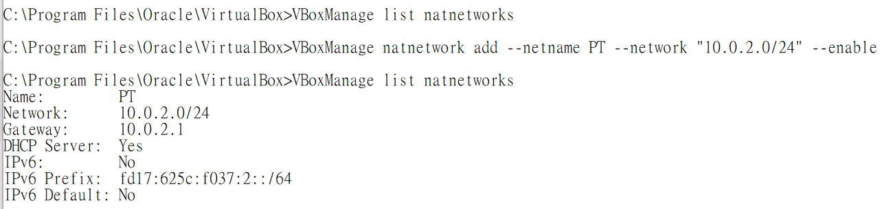
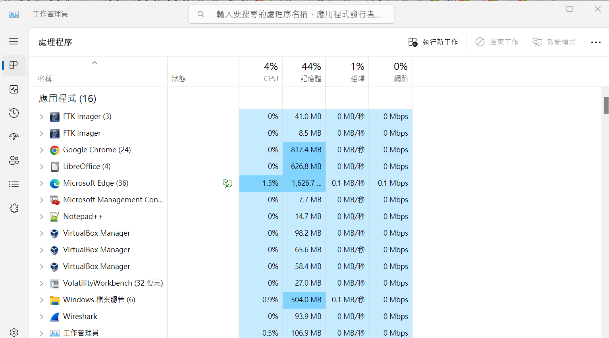
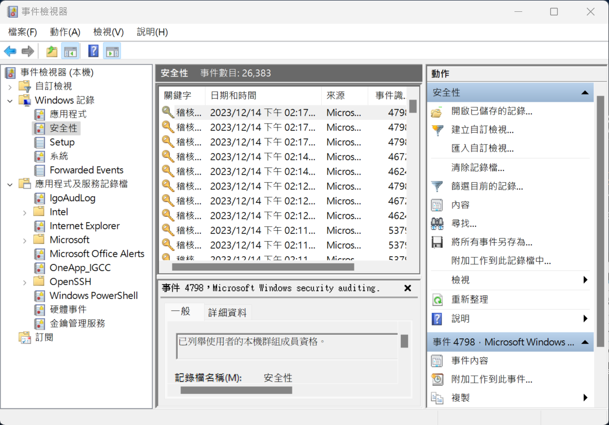
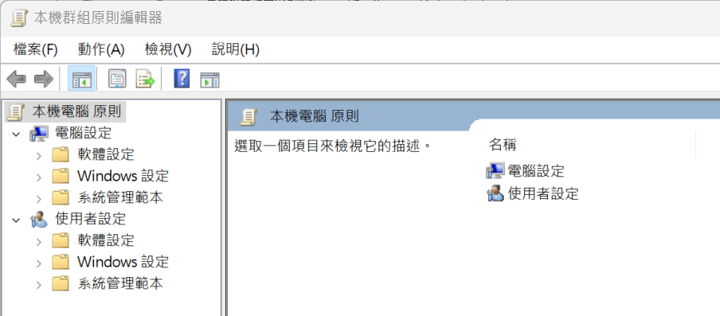
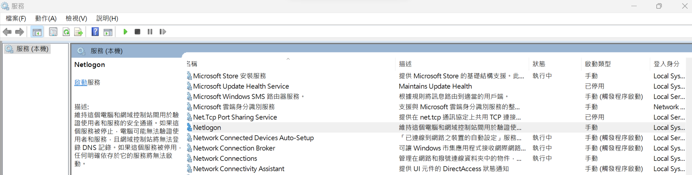
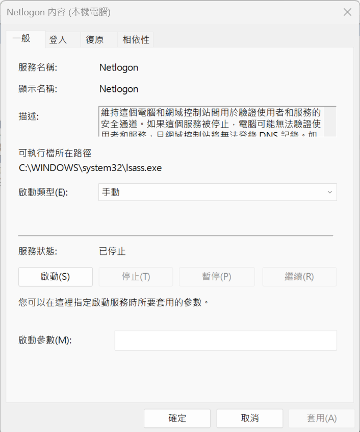

# 環境設定1:virtualbox安裝與設定
- 標準安裝virtualbox ==> 下一步下一步就裝好了
- 使用系統管理員身分啟動cmd
- 切換到VirtualBox 目錄 ==> cd C:\Program Files\Oracle\VirtualBox
- 檢視現有NAT網路 == > VBoxManage list natnetworks
- 新增NAT網路 == > VBoxManage natnetwork add --netname PT --network "10.0.2.0/24" --enable
- 再次檢視現有NAT網路 == >VBoxManage list natnetworks

# 環境設定2:
- 確認攻擊機(Kali linux)與靶機(Metasploitable3)在同一個NAT網路
- 兩台機器都可以ping 到對方 

# A.駭客攻防實戰營(1):Kali linux 攻擊與滲透測試技術
- nmap
- metsaploit

# B.駭客攻防實戰營(2):如何阻擋駭客攻擊?
### 你必須要知道的Windows作業系統常用工具
- 工作管理員(TaksManager)

- 事件檢視器(EventViewser)

- gpedit.msc

- services.msc
### Windows 指令(Windows Commands)
- 參考網址:https://learn.microsoft.com/zh-tw/windows-server/administration/windows-commands/windows-commands
- 重要指令練習:
  - netstat指令
    - netstat -a
    - netstat -an
    - netstat -ano
  - tasklist: 顯示目前在本機電腦或遠端電腦上正在執行的處理序清單
    - https://learn.microsoft.com/zh-tw/windows-server/administration/windows-commands/tasklist 
  - taskkill 殺執行中的程式(結束一個或多個工作或處理序)
    - taskkill /PID XXXX /F
    - https://learn.microsoft.com/zh-tw/windows-server/administration/windows-commands/taskkill
  - where == > 找出檔案的位置
    - 語法: WHERE [/R dir] [/Q] [/F] [/T] pattern...
    - 描述: 顯示符合搜尋模式的檔案位置。
    - 範例1: where /R C: svchost
    - 範例2: WHERE /r c:\windows *.exe *.dll *.bat
    - https://learn.microsoft.com/zh-tw/windows-server/administration/windows-commands/where
## 實作練習
- 1.使用 cmd 開啟notepad
- 2.使用工作管理員|詳細資料 找出notepad 的PID
- 3.行程終止: 使用taskkill /PID XXXX /F  ==> 終止notepad
